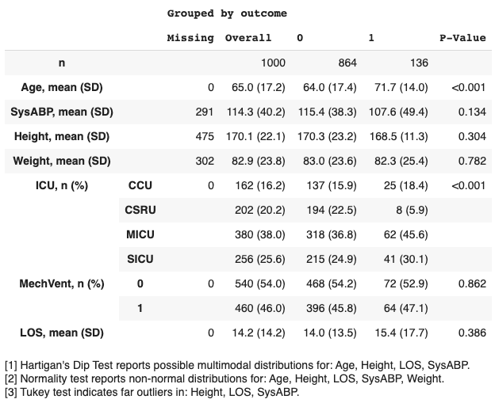
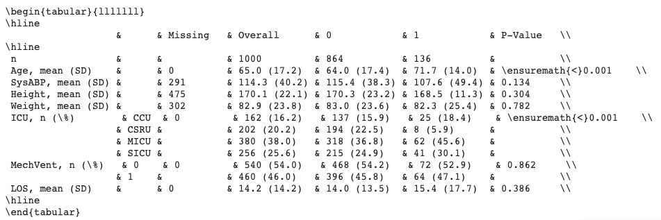

Quickstart
==========

Install
-------

::

    $ pip install tableone

See :doc:`installation <install>` document for more information.

Run demo
--------

The easiest way to understand what this package does is to evaluate it on data.

This `Google Colaboratory Notebook <https://colab.research.google.com/github/tompollard/tableone/blob/master/tableone.ipynb>`_ is an executable document that allows you to explore `tableone`. At a high level, you can use the package as follows:

* Import the data into a pandas DataFrame
  
.. image:: images/input_data.png
  :width: 600
  :alt: Starting DataFrame 

* Run tableone on this dataframe to output summary statistics
  

* Specify your desired output format: text, latex, markdown, etc.
  

Additional options include:

* Select a subset of columns.
* Specify the data type (e.g. `categorical`, `numerical`, `nonnormal`).
* Compute p-values, and adjust for multiple testing (e.g. with the Bonferroni correction).
* Compute standardized mean differences (SMDs).
* Provide a list of alternative labels for variables
* Limit the output of categorical variables to the top N rows.
* Display remarks relating to the appopriateness of summary measures (for example, computing tests for multimodality and normality).

Suggested citation
------------------

If you use tableone in your study, please cite the following paper::

    Tom J Pollard, Alistair E W Johnson, Jesse D Raffa, Roger G Mark; 
    tableone: An open source Python package for producing summary statistics 
    for research papers, JAMIA Open, Volume 1, Issue 1, 1 July 2018, Pages 26–31, 
    https://doi.org/10.1093/jamiaopen/ooy012

Download the BibTex file from: https://academic.oup.com/jamiaopen/downloadcitation/5001910?format=bibtex

Example
-------

#. Import libraries::

    from tableone import TableOne
    import pandas as pd

#. Load sample data into a pandas dataframe::

    url="https://raw.githubusercontent.com/tompollard/data/master/primary-biliary-cirrhosis/pbc.csv"
    data=pd.read_csv(url)

#. Optionally, a list of columns to be included in Table 1::

    columns = ['age','bili','albumin','ast','platelet','protime',
           'ascites','hepato','spiders','edema','sex', 'trt']

#. Optionally, a list of columns containing categorical variables::

    categorical = ['ascites','hepato','edema','sex','spiders','trt']

#. Optionally, a categorical variable for stratification and a list of non-normal variables::

    groupby = 'trt'
    nonnormal = ['bili']

#. Create an instance of TableOne with the input arguments::

    mytable = TableOne(data, columns, categorical, groupby, nonnormal)

#. Display the table using the ``tabulate`` method. The ``tablefmt`` argument allows the table to be displayed in multiple formats, including "github", "grid", "fancy_grid", "rst", "html", and "latex".::

    print(mytable.tabulate(tablefmt="github"))

#. Compute p values by setting the ``pval`` argument to `True`::

    mytable = TableOne(data, columns, categorical, groupby, nonnormal, pval=True)

#. Tables can be exported to file in various formats, including LaTeX, CSV, and HTML. Files are exported by calling the ``to_format`` method on the DataFrame. For example, mytable can be exported to an Excel spreadsheet named 'mytable.tex' with the following command::

    mytable.to_latex('mytable.tex')
